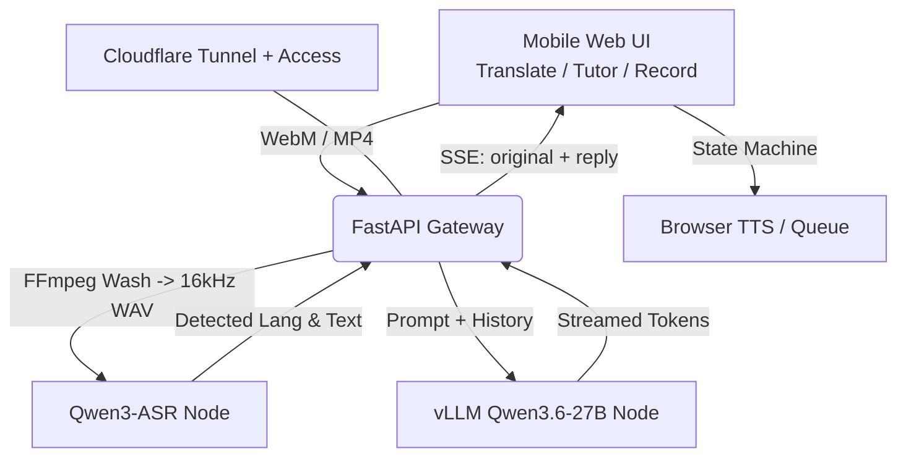

# 🗣️ 随身翻译官 / ShuiShen-Translator

A high-performance, self-hosted real-time **voice AI gateway**, built and tested on heterogeneous AMD ROCm multi-GPU hardware (with best-effort NVIDIA support; see [Hardware Support](#hardware-support)). It pairs the raw hearing of **Qwen3-ASR** with the linguistic reasoning of **Qwen3.6-27B**, all wrapped in a mobile-first, iOS-compatible web interface.

One self-hosted speech pipeline (push-to-talk → ASR → LLM → streamed reply), three product modes: a low-latency **Translator**, a voice-based **AI Tutor**, and a **Meeting Recorder**.

## ✨ Key Features

### Product Experience

* **Push-to-Talk, Mobile-First**: Record audio from any mobile or desktop browser. The UI is a single-page PWA-style app with a bottom tab bar switching between Translate / Tutor / Record.
* **Auto Language Identification (LID)**: Automatically detects the spoken language. The translator runs **3 parallel ASR passes** (native-anchored, target-anchored, and free-detect) and lets the LLM cross-reference them, including an acoustic "back-inference" step that recovers heavily-accented foreign speech mis-heard as homophones.
* **Token-Level Streaming**: Translations and tutor replies stream token-by-token over Server-Sent Events for minimal time-to-first-token.
* **Smart TTS History Queue**: Replies are pushed to a local play queue with a check-to-play system designed to bypass iOS Safari's strict audio autoplay restrictions.
* **LocalStorage Persistence**: Language preferences and per-mode history survive page refreshes. History can be exported to a `.txt` file or cleared with one click.

### Modes

Built on one real-time speech pipeline (self-hosted Qwen3-ASR + Qwen3.6-27B on vLLM/ROCm, FastAPI, Docker):

#### 1. Translator (default) — `routers/translation.py`
Push-to-talk → ASR → translation → playback, with auto language ID, conversational history, and replay. Owner-centric routing: anything not spoken in your native language is translated *to* your native language; native speech is translated *to* your chosen target language. A "third language" detection bubble lets you promote an unexpected language to the new target.

#### 2. AI Tutor — "Marine" — `routers/tutor.py`
A real-time, voice-based language tutor that adapts to the learner:
* **Struggle-adaptive** — if the learner repeatedly stalls or mispronounces, it never forces repetition; it pivots to the native language to lower anxiety, then reintroduces the target language naturally.
* **Accent-aware, face-saving correction** — an acoustic back-inference step detects when an ASR error is actually a heavily-accented attempt at the target language, and gives a gentle, natural correction without ever exposing that it was a recognition error.
* **Conversational** — 2–4 short spoken-style sentences, streamed token-by-token, with ~20 messages of context.

##### Bilingual Teaching vs Immersion (`allow_native` flag)
* **Bilingual** — uses both native (`<母语>`) and target (`<外语>`) languages, never code-mixing within a sentence (scaffolding for beginners).
* **Immersion** — target language only, for advanced practice.

#### 3. Meeting Recorder — `routers/record.py`
Continuous-listening meeting notes: 3-way noise-robust parallel ASR followed by LLM post-processing that fuses the variants, fixes cross-language mis-hearing, smooths filler words into written form, and emits a structured `language / original / translation` record. Recent turns are passed as context so proper nouns stay consistent.

### Engineering & Architecture

* **Heterogeneous Dual-GPU Engine**:
  * **Ear Node (ASR)**: a `vLLM` engine running the `Qwen3-ASR-1.7B` model on a secondary GPU.
  * **Brain Node (LLM)**: a `vLLM` engine running `Qwen3.6-27B` (4-bit GPTQ) on the flagship GPU, served under the model name `qwen3`.
* **Stateless Gateway**: a lightweight FastAPI node (no GPU) handles routing, FFmpeg audio normalization, request queueing, and SSE streaming. Each mode runs its own pool of concurrent workers fed by a priority queue.
* **Audio Pipeline**: in-memory FFmpeg normalization to pure `16kHz mono WAV` before the audio is handed to the GPU nodes.
* **Cloudflare Tunnel + Access Ready**: a `cloudflared` tunnel exposes the gateway globally, and a built-in SQLite telemetry probe hooks into the `Cf-Access-Authenticated-User-Email` header for per-user usage tracking behind Cloudflare Zero Trust.
* **Admin & VIP Priority**: an `/admin` panel (admin-only, gated on the Cloudflare Access email) lists users and lets the owner grant **VIP** status; VIP/admin requests are served at a higher queue priority.
* **Optional MCP Server**: a separate `mcp-server` exposes ASR / OCR (image + PDF) / web-search / web-fetch tools over the MCP JSON-RPC protocol for agent integrations.

## 🏗️ Architecture Matrix



## 🚀 Deployment

### Prerequisites

* Docker & Docker Compose
* A supported GPU — **AMD ROCm** (tested) or **NVIDIA** (best-effort, unverified). Apple/Intel are not functional yet; see [Hardware Support](#hardware-support).
* (Optional) A Cloudflare Tunnel token for public access
* (Optional) A Hugging Face token for gated models

### Quick Start — Docker Compose

The recommended install path. The repo ships a working `docker-compose.yml` tuned for a dual-AMD setup (7900 XTX + 7800 XT). Adjust the image/devices/model in it for your hardware, then:

```bash
git clone https://github.com/linxuhao/linxuhao-translator.git
cd linxuhao-translator

# Optionally configure your tokens in .env (CF_TUNNEL_TOKEN, HF_TOKEN)
docker compose up -d
```

> The first boot takes a while as it downloads the `Qwen3-ASR-1.7B` and `Qwen3.6-27B` models into `~/.cache/huggingface`.

> On non-AMD hardware you'll need to adapt the image/devices to your GPU — see [Hardware Support](#hardware-support). An experimental auto-installer that generates this compose file for you is also documented there.

### Access the UI

Navigate to <http://localhost:5000> (or your Cloudflare Tunnel domain).

| Route | Mode |
|-------|------|
| `/`        | Translator |
| `/tutor`   | AI Tutor ("Marine") |
| `/record`  | Meeting Recorder |
| `/admin`   | Admin panel (admin email only) |

> iOS requires HTTPS or `localhost` to grant microphone permissions.

## 🖥️ Hardware Support

The installer ships GPU profiles for four vendors, but they are at very different maturity levels. Honest status:

| Hardware | Status | Notes |
|----------|--------|-------|
| ✅ **AMD / ROCm** | Tested | The project is developed and runs in production on a dual-GPU AMD box. This is the supported path. |
| 🟡 **NVIDIA** | Best-effort | A profile exists and is plausible, but has **not been verified on real NVIDIA hardware** yet. |
| 🔴 **Apple (Metal/MPS)** | Not functional yet | Profile present, but the `vllm/vllm-openai` image has **no Metal/MPS backend**, so vLLM can't serve the models on Apple Silicon. |
| 🔴 **Intel (XPU)** | Not functional yet | Profile present, but the `vllm/vllm-openai` image has **no XPU backend**, so vLLM can't serve the models on Intel GPUs. |

If you're on AMD, follow the [Quick Start](#quick-start--docker-compose) as-is. On NVIDIA expect to do some debugging. Apple and Intel are wired into the installer for the future but won't serve models with the current vLLM image.

### Experimental: Hardware-Adaptive Installer (AMD-tested)

`install.sh` is a convenience wrapper that auto-detects your GPU vendor and VRAM, picks a profile from `config/hardware_profiles.yml` (single- or dual-GPU), generates a matching `docker-compose.yml`, and deploys. It is **experimental and only validated on AMD/ROCm** — NVIDIA is best-effort and Apple/Intel are non-functional, exactly as in the table above. It is **not** the recommended general path; prefer the [Quick Start](#quick-start--docker-compose) and adapt the compose file by hand.

```bash
git clone https://github.com/linxuhao/linxuhao-translator.git
cd linxuhao-translator

./install.sh                  # auto-detect, generate config, deploy
./install.sh --list-profiles  # show all available hardware profiles
./install.sh --profile amd_single_24gb   # force a specific profile
./install.sh --dry-run        # detection only, no changes
```

One-line bootstrap (clone + install):

```bash
curl -fsSL https://raw.githubusercontent.com/linxuhao/linxuhao-translator/main/bootstrap.sh | bash
```

## 🛣️ Roadmap

- [x] Phase 1: Core translation loop & LLM routing.
- [x] Phase 2: Hardware acceleration (vLLM for ASR + LLM) & iOS audio compatibility.
- [x] Phase 3: Persistent TTS history queue and UI metrics.
- [x] Phase 4: Multi-mode expansion — AI Tutor ("Marine") + Meeting Recorder on the shared pipeline.
- [x] Phase 5: Hardware-adaptive installer (AMD tested; NVIDIA best-effort; Apple/Intel profiles present but not yet functional — see [Hardware Support](#hardware-support)).
- [ ] Phase 6 (Next): WebRTC Voice Activity Detection (VAD) chunking + true real-time streaming translation.

## 📜 License

MIT License — © 2026 Lin Xuhao.
