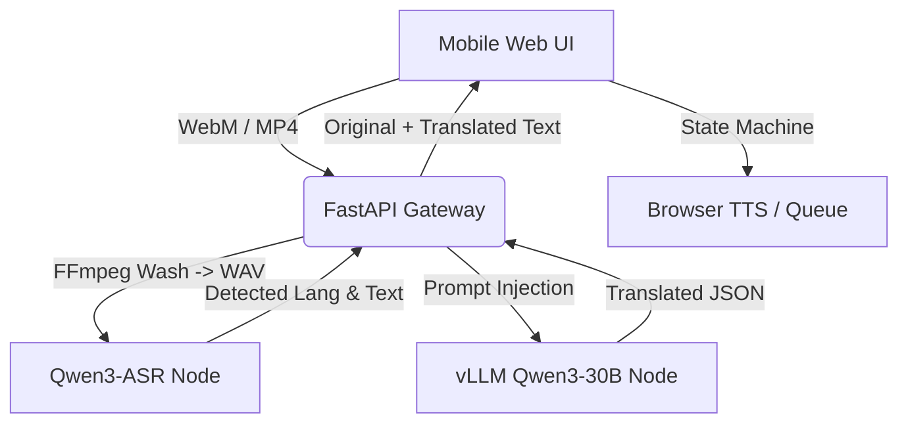

# 🗣️ 随身翻译官

A high-performance, self-hosted AI translation gateway optimized for heterogeneous AMD ROCm multi-GPU environments. It combines the raw hearing capability of **Qwen3-ASR** with the linguistic reasoning of **Qwen3-30B**, wrapped in a mobile-first, iOS-compatible web interface.

## ✨ Key Features

### Product Experience

* **Push-to-Talk Translation**: Seamlessly record audio via mobile or desktop browsers.
* **Auto Language Identification (LID)**: Automatically detects the spoken foreign language and translates it to your native language (and vice versa).
* **Smart TTS History Queue**: Translations are pushed to a local queue. Includes a check-to-play system designed specifically to bypass iOS Safari's strict audio autoplay restrictions.
* **LocalStorage Persistence**: Your native language preference and translation history survive page refreshes.
* **Export & Clear**: Export your entire translation history to a `.txt` file or clear it with one click.
* **Hardware-Level Latency Probes**: Built-in debug panel detailing Network, Gateway, ASR, and LLM inference latencies in real-time.

### Engineering & Architecture

* **Heterogeneous Dual-GPU Engine**: 
  * **Ear Node (ASR)**: Native PyTorch `transformers` with SDPA acceleration running on a secondary GPU (e.g., AMD RX 7800 XT).
  * **Brain Node (LLM)**: High-throughput `vLLM` engine running a 30B LLM on a flagship GPU (e.g., AMD RX 7900 XTX).
* **Audio Pipeline**: FFmpeg Audio normalization to the FastAPI gateway, feeding pure `16kHz WAV` directly into the GPU memory.
* **Cloudflare Access Ready**: Built-in SQLite telemetry probe that hooks into `Cf-Access-Authenticated-User-Email` headers for usage tracking behind Cloudflare Zero Trust.

## 🏗️ Architecture Matrix



## 🚀 Deployment

### Prerequisites

Docker & Docker Compose

AMD ROCm compatible GPUs (or NVIDIA equivalents by changing the base images in docker-compose.yml)

Hugging Face Token (for gated models) - Not necessary

Cloudflare token for public DNS access

## Quick Start

### Clone the repository

```bash
git clone https://github.com/linxuhao/linxuhao-translator.git
```

cd linxuhao-translator
Configure Environment:
Ensure your .env file contains your cloudflare token.

### Spin up the Matrix

```bash
docker compose up -d
```

Note: The first boot will take some time as it downloads the Qwen3-ASR (1.7B) and Qwen3 (30B) models.

Access the UI:
Navigate to <http://localhost:5000> (or your reverse proxy domain). Note: iOS requires HTTPS or localhost to grant microphone permissions.

### 🛣️ Roadmap

[x] Phase 1: Core translation loop & LLM routing.

[x] Phase 2: Hardware acceleration (SDPA for ASR, vLLM for LLM) & iOS audio compatibility.

[x] Phase 3: Persistent TTS history queue and UI metrics.

[ ] Phase 4 (Next): WebRTC Voice Activity Detection (VAD) chunking + Server-Sent Events (SSE) for true real-time streaming translation.

[ ] Phase 5 (Later): Generalize the project

📜 License
MIT License.