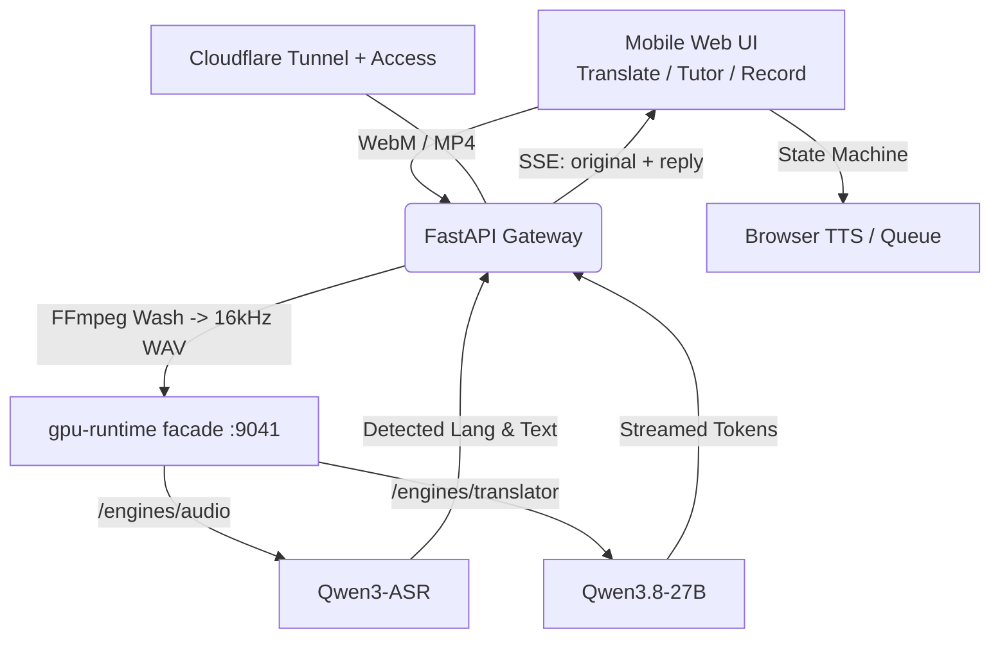

# 🗣️ 随身翻译官 / ShuiShen-Translator

A self-hosted real-time **voice AI gateway**: push-to-talk → ASR → LLM → streamed reply, wrapped in a mobile-first, iOS-compatible web interface. It pairs the raw hearing of **Qwen3-ASR** with the linguistic reasoning of a **Qwen3.8-27B** translator model, both served by a separate GPU layer.

Three product modes on one speech pipeline: a low-latency **Translator**, a voice-based **AI Tutor**, and a **Meeting Recorder**.

## ✨ Key Features

### Product Experience

* **Push-to-Talk, Mobile-First**: Record audio from any mobile or desktop browser. The UI is a single-page PWA-style app with a bottom tab bar switching between Translate / Tutor / Record.
* **Auto Language Identification (LID)**: Automatically detects the spoken language. The translator runs **3 parallel ASR passes** (native-anchored, target-anchored, and free-detect) and lets the LLM cross-reference them, including an acoustic "back-inference" step that recovers heavily-accented foreign speech mis-heard as homophones.
* **Token-Level Streaming**: Translations and tutor replies stream token-by-token over Server-Sent Events for minimal time-to-first-token.
* **Smart TTS History Queue**: Replies are pushed to a local play queue with a check-to-play system designed to bypass iOS Safari's strict audio autoplay restrictions.
* **LocalStorage Persistence**: Language preferences and per-mode history survive page refreshes. History can be exported to a `.txt` file or cleared with one click.

### Modes

#### 1. Translator (default) — `routers/translation.py`
Push-to-talk → ASR → translation → playback, with auto language ID, conversational history, and replay. Owner-centric routing: anything not spoken in your native language is translated *to* your native language; native speech is translated *to* your chosen target language. A "third language" detection bubble lets you promote an unexpected language to the new target.

#### 2. AI Tutor — "Marine" — `routers/tutor.py`
A real-time, voice-based language tutor that adapts to the learner:
* **Struggle-adaptive** — if the learner repeatedly stalls or mispronounces, it never forces repetition; it pivots to the native language to lower anxiety, then reintroduces the target language naturally.
* **Accent-aware, face-saving correction** — an acoustic back-inference step detects when an ASR error is actually a heavily-accented attempt at the target language, and gives a gentle, natural correction without ever exposing that it was a recognition error.
* **Conversational** — 2–4 short spoken-style sentences, streamed token-by-token, with ~20 messages of context.

##### Bilingual Teaching vs Immersion (`allow_native` flag)
* **Bilingual** — uses both native (`<母语>`) and target (`<外语>`) languages, never code-mixing within a sentence (scaffolding for beginners).
* **Immersion** — target language only, for advanced practice.

#### 3. Meeting Recorder — `routers/record.py`
Continuous-listening meeting notes: 3-way noise-robust parallel ASR followed by LLM post-processing that fuses the variants, fixes cross-language mis-hearing, smooths filler words into written form, and emits a structured `language / original / translation` record. Recent turns are passed as context so proper nouns stay consistent.

### Engineering & Architecture

* **Stateless Gateway**: a lightweight FastAPI node (no GPU) handles routing, FFmpeg audio normalization, request queueing, and SSE streaming. Each mode runs its own pool of concurrent workers fed by a priority queue.
* **Audio Pipeline**: in-memory FFmpeg normalization to pure `16kHz mono WAV` before the audio is handed to the GPU layer.
* **GPU layer behind one HTTP facade**: ASR (`/engines/audio/v1/audio/transcriptions/details`, with a language hint) and the LLM (`/engines/translator/v1/chat/completions`) are served by [gpu-runtime](https://github.com/linxuhao/gpu-runtime), which owns the GPUs and schedules every engine. The gateway holds a bearer token, mounted from a file, and nothing else about the hardware.
* **Cloudflare Tunnel + Access Ready**: a tunnel exposes the gateway globally, and a built-in SQLite telemetry probe hooks into the `Cf-Access-Authenticated-User-Email` header for per-user usage tracking behind Cloudflare Zero Trust.
* **Admin & VIP Priority**: an `/admin` panel (admin-only, gated on the Cloudflare Access email) lists users and lets the owner grant **VIP** status; VIP/admin requests are served at a higher queue priority.

## 🏗️ Architecture


```mermaid
graph TD
    A[Mobile Web UI<br/>Translate / Tutor / Record] -->|WebM / MP4| B(FastAPI Gateway)
    B -->|FFmpeg Wash -> 16kHz WAV| C[gpu-runtime facade :9041]
    C -->|/engines/audio| D[Qwen3-ASR]
    C -->|/engines/translator| E[Qwen3.8-27B]
    D -->|Detected Lang & Text| B
    E -->|Streamed Tokens| B
    B -->|SSE: original + reply| A
    A -->|State Machine| F[Browser TTS / Queue]
    G[Cloudflare Tunnel + Access] --- B
```

This repository is the gateway only. Until 2026-09-16 it also carried the engines, an MCP
server and a media stack; those now live in their own repositories and compose projects:
[agentmcp](https://github.com/linxuhao/agentmcp) (the MCP layer) and
[gpu-runtime](https://github.com/linxuhao/gpu-runtime) (everything that touches a GPU).

## 🚀 Deployment

### Prerequisites

* Docker & Docker Compose
* A reachable gpu-runtime facade and its bearer token file
* (Optional) A Cloudflare Tunnel for public access

### Docker Compose

```bash
git clone https://github.com/linxuhao/linxuhao-translator.git
cd linxuhao-translator
cp .env.example .env     # GPU_HOST / LINXUHAO_AI_IP / GPU_LOCK_DIR / CF_EDGE_NETWORK
docker compose up -d --build
```

The gateway joins the tunnel's rendezvous network by name (`CF_EDGE_NETWORK`), so it becomes
public as soon as the tunnel's hostname points at `api_gateway:5000`.

### Access the UI

Navigate to <http://localhost:5000> (or your Cloudflare Tunnel domain).

| Route | Mode |
|-------|------|
| `/`        | Translator |
| `/tutor`   | AI Tutor ("Marine") |
| `/record`  | Meeting Recorder |
| `/admin`   | Admin panel (admin email only) |

> iOS requires HTTPS or `localhost` to grant microphone permissions.

### Tests

`tests/asr_contract.py` pins the request the gateway sends to the ASR engine (multipart WAV
with concrete RIFF sizes, model name, language hint) against a mock transport.

## 🛣️ Roadmap

- [x] Phase 1: Core translation loop & LLM routing.
- [x] Phase 2: Hardware acceleration & iOS audio compatibility.
- [x] Phase 3: Persistent TTS history queue and UI metrics.
- [x] Phase 4: Multi-mode expansion — AI Tutor ("Marine") + Meeting Recorder on the shared pipeline.
- [x] Phase 5: Engines moved behind the gpu-runtime facade; the gateway is hardware-agnostic.
- [ ] Phase 6 (Next): WebRTC Voice Activity Detection (VAD) chunking + true real-time streaming translation.

## 📜 License

MIT License — © 2026 Lin Xuhao.
